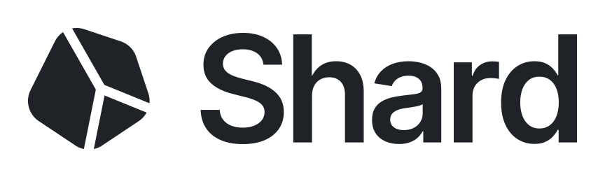

<div align="center">
  <picture>
    <source media="(prefers-color-scheme: dark)" srcset=".github/assets/banner-dark.svg">
    
  </picture>

  <p>Свободный AI-античит с открытым исходным кодом для Minecraft-серверов.</p>

  <p>
    <a href="README.md">English</a>
    ·
    <a href="README.ru.md"><b>Русский</b></a>
    ·
    <a href="https://shard.ac">shard.ac</a>
    ·
    <a href="https://app.shard.ac">Панель</a>
    ·
    <a href="https://discord.gg/kaelus">Discord</a>
  </p>

  <p>
    <a href="https://github.com/KaelusAI/Shard/actions/workflows/ci.yml">
      
    </a>
    <a href="https://app.codacy.com/gh/KaelusAI/Shard/dashboard?utm_source=gh&utm_medium=referral&utm_content=&utm_campaign=Badge_grade">
      
    </a>
    <a href="https://discord.gg/kaelus">
      
    </a>
    <a href="https://github.com/KaelusAI/Shard/">
      
    </a>
  </p>
</div>

## Что такое Shard

Shard - combat-античит с открытым исходным кодом для Minecraft-серверов. AI-модель проверяет движения мыши игрока и обнаруживает killaura и aim assist.

## Важный момент перед установкой

AI-проверка Shard использует официальный Shard API. Зарегистрируйтесь на [app.shard.ac](https://app.shard.ac), чтобы получить доступ.

Доступны две модели, выбрать нужную можно в панели:

- **Flash** - на всех тарифах, включая бесплатный, верификация не нужна
- **Pro** - обнаруживает больше читов, дороже

Чтобы подключить сервер к API, выполните `/shard connect` и подтвердите привязку в панели.

При отсутствии доступа к API AI-проверку следует временно отключить.

## Требования

- Java 17+ для запуска плагина
- JDK 21+ для сборки проекта
- сервер на Paper или Folia

## Установка

1. Скачать актуальный релиз из [GitHub Releases](https://github.com/KaelusAI/Shard/releases).
2. Поместить основной `Shard-<version>.jar` в каталог `plugins/`.
3. Один раз запустить сервер, чтобы Shard создал конфиги.
4. Выполнить `/shard connect` и подтвердить привязку в панели.
5. При необходимости настроить хранилище:
   - SQLite используется по умолчанию
   - MySQL и MariaDB тоже поддерживаются
6. При использовании WorldGuard можно исключить нужные регионы из AI-проверки.
7. Перезапустить сервер или перезагрузить конфигурацию плагина.

## Файлы конфигурации

- [`config.yml`](src/main/resources/config.yml): AI, база данных, Redis, межсерверные оповещения, алерты и обработка дублирующихся пакетов движения
- [`monitor.yml`](src/main/resources/monitor.yml): выводы, лимиты, темы и формат `/shard monitor` и `/shard view`
- [`punishments.yml`](src/main/resources/punishments.yml): правила наказаний
- [`messages/messages_en.yml`](src/main/resources/messages/messages_en.yml): английская локализация
- [`messages/messages_ru.yml`](src/main/resources/messages/messages_ru.yml): русская локализация

## Основные команды

| Команда | Что делает |
| --- | --- |
| `/shard connect` | Привязывает сервер к панели |
| `/shard connect status` | Показывает статус подключения к панели |
| `/shard disconnect` | Отвязывает сервер от панели |
| `/shard alerts` | Включает и выключает уведомления о нарушениях |
| `/shard suspicious <list\|top\|flagged>` | Показывает подозрительных игроков и онлайн-игроков с флагами |
| `/shard profile <player>` | Открывает профиль игрока |
| `/shard monitor <player>` | Показывает AI-данные игрока в реальном времени |
| `/shard monitor add\|remove\|clear` | Отслеживает нескольких игроков сразу |
| `/shard monitor output <type>` | Рисует монитор в action bar, боссбаре, сайдбаре, чате или таб-листе |
| `/shard monitor settings` | Показывает и меняет настройки монитора |
| `/shard view` | Переключает режим наблюдения за игроками |
| `/shard logs [page]` | Показывает недавние нарушения |
| `/shard history <player> [page]` | Показывает историю нарушений игрока |
| `/shard stats` | Показывает статистику античита по серверу |
| `/shard dc <start\|stop\|cancel\|status>` | Управляет сессиями сбора данных |
| `/shard reload` | Перезагружает конфигурацию Shard |

Полный список команд доступен через `/shard help`.

## Сборка из исходников

```bash
git clone https://github.com/KaelusAI/Shard.git
cd Shard
./gradlew shadowJar
```

Готовый jar появится в `build/libs/Shard-<version>.jar`.

## Помощь, баг-репорты и обсуждение

- Баг-репорты: [GitHub Issues](https://github.com/KaelusAI/Shard/issues)
- Сообщество и поддержка: [Discord](https://discord.gg/kaelus)

При создании issue рекомендуется приложить:

- версию сервера
- версию Java
- версию плагина
- важные фрагменты конфига
- логи, stack trace и шаги воспроизведения

## Благодарности

У Shard собственная, независимо разработанная кодовая база. Тем не менее часть его кода адаптирована из open-source проекта [GrimAC](https://github.com/GrimAnticheat/Grim), и Shard опирается на идеи, разработанные GrimAC, DefineOutside и другими участниками проекта GrimAC - им полная признательность и благодарность за работу.

## Лицензия

Shard распространяется на условиях лицензии [GNU General Public License v3.0](LICENSE).


